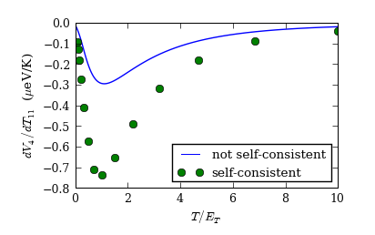
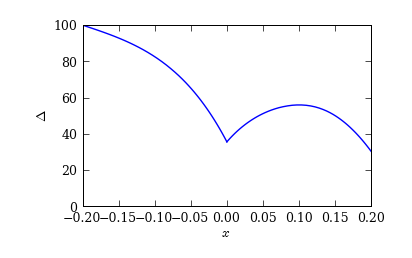
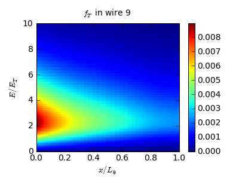

.. index:: thermovoltage, superconducting wire

**********************
Nonlocal thermovoltage
**********************

This roughly addresses the experiment in [CZ]_.  The structure studied
could be roughly mapped on:

    .. aafig::
    
                           N0
                           |0
                           |
                        1  |  9    4
               XXXXXS1KKKKK6KKKKK9KKKKKN4
               X           |
               X           |6
               X           |  7
               X   Phi     7-----N11
               X           |
               X           |8
               X        2  |  10    5
               XXXXXS2KKKKK8KKKKK10KKKKN5
                           |
                           |
                          3|
                           N3
        
        
         "N: normal terminals"
         "S: superconducting terminals"
        
         --- "normal wire"
         KKK "superconducting wire"
         XXX "superconducting part omitted from the model"

To try to model the actual experimental structure, resistive interface
boundary conditions would be needed.  In the calculations below, all
interfaces are clean.

What's calculated below is the potential at N4 when N11 is heated and
all terminals float. All parameters have been chosen relatively
arbitrarily and have not been specially tuned. You may wish to adjust
them to see what happens.

An important question in the calculation is whether the change
:math:`d\Delta` in the order parameter (caused by the applied heating)
should be taken into account. One can argue that it does not
contribute in the linear response:

1. The current entering terminal 4 is a function of the temperatures
   and potentials of the N-terminals, and a functional of the order parameter:

   .. math::

      I_4 = I_4[\Delta, \{V_j\}, \{T_j\}]

   Here, :math:`\Delta` is a function of :math:`\{V_j\}` and
   :math:`\{T_j\}`.  It is understood that the dependence from
   :math:`\{V_j\}` and :math:`\{T_j\}` arguments in :math:`I_4` is
   that obtained from a calculation with a fixed (possibly
   non-self-consistent) :math:`\Delta`.

2. In the linear response the above is written as

   .. math::

      d I_4 = \frac{\delta I_4}{\delta\Delta}[d\Delta]
            + \sum_j ( \frac{\partial I_4}{\partial V_j} d V_j + \frac{\partial I_4}{\partial T_j} d T_j )

   where the (functional) derivatives are evaluated at equilibrium,
   holding all other variables constant.

3. Because at equilibrium :math:`I_4[\Delta] = 0` for any :math:`\Delta`,
   :math:`\frac{\delta I_4}{\delta\Delta}=0`, and the first term above
   vanishes.

Similarly for currents :math:`I_0`, :math:`I_3`, :math:`I_5`,
:math:`I_{11}`.  Hence, the thermovoltage :math:`d V_4/dT_{11}` *does
not contain* any contribution from the linear-response change
:math:`d\Delta` of the order parameter, and can be calculated directly
from the Usadel equation without a need for nonequilibrium
self-consistency.

This means that the only effect of using a self-consistent order
parameter is that it tunes the diffusion and decay constants and the
spectral supercurrent. I'd expect this effect to not cause any qualitative
changes.

.. seealso:: `example-nonlocal-thermovoltage.py <_static/scripts/example-nonlocal-thermovoltage.py>`__

.. [CZ] P. Cadden-Zimansky, J. Wei, V. Chandrasekhar, 
        *Nature Phys.* **5**, 393 (2009).

Geometry specification & code
=============================

See the ``example-nonlocal-thermovoltage.py`` in the ``scripts``
subdirectory; calculation goes as in
:ref:`thermoelectricity-in-4-probe-structure`.

.. index:: self-consistency

The only addition is the optional self-consistent iteration
for the order parameter (not taking into account the linear-response
part :math:`d\Delta`):

.. sourcecode:: python

        for T in logspace(log10(dT + 1e-4), log10(10), n_T):
            # Optional self-consistent iteration
            if do_selfconsistent_iteration:
                g.t_mu = 0
                g.t_t = T
                it = u.self_consistent_matsubara_iteration(g)
                #it = u.self_consistent_realtime_iteration(solver)
                for k, d, I_error in it:
                    print "%% Self-consistent iteration %d (residual %g)" % (
                        k, d.residual_norm())
                    if (d.relative_residual_norm() < 1e-4 and I_error < 1e-5):
                       break
                else:
                    raise RuntimeError("Self-cons. iteration didn't converge!")

                solver.solve_spectral()
                solver.calculate_G()
                solver.save("nonlocal_thermovoltage_T_%.2f.h5" % T)

Here, we create an iterator corresponding to the Matsubara iteration,
and iterate until :math:`\Delta` stops changing.

Results
=======

The calculation yields a finite thermovoltage at terminal 4 in response
to heating in terminal 11.

The result with a self-consistent (equilibrium) order parameter shows
a larger thermovoltage, but this is only because the order parameter
is significantly suppressed from the bulk value in the superconducting
wires 1---9 (assumed of dimensionless length 0.2):

What occurs can be understood in a simple way: a finite potential
(:math:`f_T`) is induced at node 6 via the usual mechanism, and it
propagates (as a non-equilibrium sub-gap excitation) through the
superconducting wire, causing a potential to be induced to floating
terminal 4. This is the clean-interface analogue of the crossed
Andreev reflection. Propagation of the excitation is easily seen by
looking at :math:`f_T` in wire 9:

How large the effect is depends on how long the superconducting
piece between 6--9 is, and the magnitude should decay exponentially
as the length
increases, due to charge mode relaxation. The characteristic length
scale is not the inelastic relaxation length, because everything happens
below the gap. Instead, it is proportional to the superconducting
coherence length, as can be seen from the form of the sink terms
in the Usadel equation:

.. math::

   D\nabla\cdot j_L = 0 \\
   D\nabla\cdot j_T = (\nabla\cdot j_S) f_L
                    - 2|\Delta|\mathop{\rm Im}[\cos(\phi-\chi)\sinh\theta] f_T

The latter term participates in converting the sub-gap excitation
to supercurrent, and the coefficient is large below the gap even deep in
the superconductor where the phase of the order parameter
:math:`\phi\approx\chi`. It is clear that the length scale corresponding
to decay of :math:`f_T` must be proportional to
:math:`\xi_0=\sqrt{\hbar D/|\Delta|}`.
