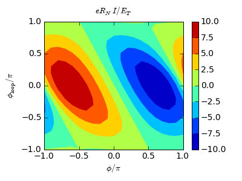

.. index:: SQUID, magnetic field, loop, magnetic flux

***************
Proximity SQUID
***************

Supercurrent in the proximity SQUID.

Assume the geometry:

    .. aafig::
    
                -------
               /       \
        0-----1   Phi   2-----3
               \       /
                -------
    
where terminals 0 and 3 are taken as superconducting.  What is the
supercurrent between 0 and 3 as a function of the phase difference and
the flux :math:`\Phi`?

.. seealso:: `example-proximity-squid.py <_static/scripts/example-proximity-squid.py>`__

Geometry specification
======================

Define a function that returns the geometry for given phase difference 
and phase jump (:math:`2\Phi`) corresponding to the flux:

.. sourcecode:: python

    def get_geometry(phi, phi_loop):

        # 4 nodes and 4 wires
        g = u.Geometry(4, 4)

        g.t_type = [u.NODE_CLEAN_S_TERMINAL,
                    u.NODE_CLEAN_NODE,
                    u.NODE_CLEAN_NODE,
                    u.NODE_CLEAN_S_TERMINAL]

        # Energy gaps at nodes (has no effect except at terminals)
        g.t_delta = [ 50, 0, 0, 50]
        # Superconducting phases at nodes (has no effect except at terminals)
        g.t_phase = array([ -.5, 0, 0, .5 ]) * phi
        # Inelastic scattering parameter \Gamma
        g.t_inelastic = 1e-9
        # Spin-flip scattering parameter \Gamma_sf
        g.t_spinflip = 0
        # Temperature
        g.t_t = 10
        # Potentials
        g.t_mu = 0

        # Normal-metal structure
        g.w_type = u.WIRE_TYPE_N
        # Wire lengths
        g.w_length = [ 1./3, 1./3, 1./3, 1./3 ]
        # Wire conductance-area products
        g.w_conductance = [ 1, 1, 1, 1 ]

The magnetic field is taken into account with a gauge transformation

.. math::

   \bar{\gamma}(x) = e^{-\frac{2ie}{\hbar}\int_0^x d\vec{l} \vec{A}(\vec{x})}\gamma(x) = e^{-2i\pi \Delta\Phi(x)/\Phi_0}\gamma(x) = e^{-i \phi_{B}(x)}\gamma(x)

which causes discontinuities in the gauge-transformed
:math:`\bar\gamma`. The function :math:`\phi_B(x)` can be chosen separately
for each wire, according the vector potential parallel to each, provided
the node conditions are transformed accordingly.

In this code, the magnetic phase jumps in each wire are specified by
setting :attr:`w_phase_jump <Geometry.w_phase_jump>`:

.. sourcecode:: python

        # Phase jumps at ends of wires 1 and 2, due to applied field
        g.w_phase_jump[1] = phi_loop
        g.w_phase_jump[2] = 0

        # Specify the connections between wires and nodes
        g.w_ends[0,:] = [ 1, 0 ]
        g.w_ends[1,:] = [ 1, 2 ]
        g.w_ends[2,:] = [ 1, 2 ]
        g.w_ends[3,:] = [ 3, 2 ]

        return g

Now comes a subtle point: suppose we had chosen

.. sourcecode:: python

        g.w_phase_jump[1] =  phi_loop/2
        g.w_phase_jump[2] = -phi_loop/2

to describe the same physical situation. Then,
:math:`I_S(\phi,\phi_{\rm loop})\ne{}I_S(\phi,\phi_{\rm loop}+2\pi)`,
even though both :math:`\phi_{\rm loop} = \Phi/\Phi_0` and :math:`I_S`
are gauge-invariant quantities.

The reason why this occurs is simply that the phase difference
:math:`\phi` is not gauge invariant, and in the gauge we chose
implicitly when specifying the phase jumps the actual phase difference
is a function of :math:`\Phi`. Indeed, we can easily see that two
gauge-invariant phase differences between the superconductors can be
defined: :math:`\varphi_1=\phi+\phi_{\rm loop}/2` and
:math:`\varphi_2=\phi-\phi_{\rm loop}/2`, corresponding to paths going
throught the left and right arms of the loop.  Both
:math:`I_S(\varphi_1,\phi_{\rm loop})` and
:math:`I_S(\varphi_2,\phi_{\rm loop})` are :math:`2\pi`-periodic in
their arguments.

In the simpler gauge choice we use below, the :math:`\phi` in the
numerics is gauge invariant as-is.

    
Supercurrent
============

Supercurrent and the circulating current can then be solved as before:

.. sourcecode:: python

    def main():
        output = open('proximity-squid.dat', 'w')

        print >> output, "%% %14s %14s %14s %14s %14s" % (
            "phi", "phi_loop", "T", "current", "circulating")

        for phi in linspace(-pi, pi, 21):
            for phi_loop in linspace(-pi, pi, 21):
                geometry = get_geometry(phi, phi_loop)
                currents = u.CurrentSolver(geometry, ne=260,
                                           output_function=lambda x: None)
                currents.set_solvers(sp_solver=u.SP_SOLVER_TWPBVP)
                currents.solve_spectral()

                print phi, phi_loop, "..."

                for T in linspace(1e-6, 20, 100):
                    geometry.t_t = T
                    Ic, Ie = currents.get_currents(ix=0)

                    print >> output, "  %14.5g %14.5g %14.5g %14.5g %14.5g" % (
                        phi, phi_loop, T, Ic[0], Ic[1] - Ic[2])

    if __name__ == "__main__":
        main()

After about 40 min, a result is obtained: at :math:`T = 0`,

And at :math:`T = 10 E_T`:

