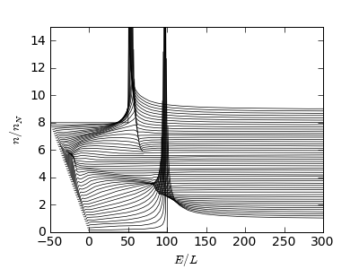
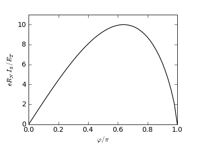

.. index:: SNS junction

*******************
Single SNS junction
*******************

.. currentmodule:: usadel1

We want to calculate for an SNS junction:

- The density of states for a given phase difference
- The supercurrent-phase relation at a low temperature

.. seealso::

   `example-sns.py <_static/scripts/example-sns.py>`__

Loading libraries
=================

First, libraries need to be loaded:

.. code-block:: python

   from scipy import *
   import usadel1 as u

.. index:: geometry

Specifying the geometry
=======================

All calculations start with a geometry specification.
An SNS junction can be modeled with two S-terminals and one N-wire:

.. code-block:: python

   geometry = u.Geometry(nwire=1, nnode=2)

   geometry.t_type = [u.NODE_CLEAN_S_TERMINAL, u.NODE_CLEAN_S_TERMINAL]
   geometry.w_type = [u.WIRE_TYPE_N]

The wire is connected to both terminals:

.. code-block:: python

   geometry.w_ends[0,:] = [0, 1]

Note that all indices are zero-based; the first terminal is 0 and the
second 1.

Moreover, currently only clean interface boundary conditions are
implemented. In principle, these would be straightforward to add; the
place to put them would be in ``sp_equations.f90``.

Then, assign a phase difference and energy gap for the terminals:

.. code-block:: python

   geometry.t_delta = [100, 100]
   geometry.t_phase = [-.25*pi, .25*pi]

and set wire properties

.. code-block:: python

   geometry.w_length = 1
   geometry.w_conductance = 1

.. index:: density of states

Solving DOS
===========

Next, the spectral equations can be solved, and results saved to a file:

.. code-block:: python

   solver = u.CurrentSolver(geometry)

   solver.set_tolerance(sp_tol=1e-8)
   solver.solve_spectral()
   solver.save('sns-spectral.h5')

To capture the SNS junction minigap edge correctly at phase
differences :math:`\varphi>0.7\pi`, we need to set a stricter
tolerance :math:`10^{-8}` than the default :math:`10^{-4}` for the
spectral solver. This has an impact on speed, however.

The results can be inspected with any program that can read HDF5
files, for example :program:`Matlab` (use the supplied ``scripts/h5load.m``
script to load HDF5 files), or :program:`Python`:

.. code-block:: python

   a, b = solver.spectral.a, solver.spectral.b
   E, x = solver.spectral.E, solver.spectral.x
   dos = real((1 + a*b)/(1 - a*b))

The :class:`solver <CurrentSolver>` object has attributes
:attr:`spectral <CurrentSolver.spectral>`, :attr:`coefficient
<CurrentSolver.coefficient>`, :attr:`kinetic <CurrentSolver.kinetic>`
that contain the solutions (Riccati parameters) :math:`a`, :math:`b`
to the spectral equations, the kinetic coefficients, :math:`D_L`,
:math:`D_T`, :math:`{\cal T}`, :math:`j_S`, and the solutions to the
kinetic equations, :math:`f_L`, , :math:`f_T`. The Green function
is parameterized in a mixed Riccati--distribution function scheme

.. math::

   \hat{G}^R = \frac{1}{1 - a b} \begin{pmatrix} 
   1 + a b & 2 a \\ -2 b & -(1 + a b) \end{pmatrix}

.. math::

   \hat{G}^K = (\hat{G}^R - \hat{G}^A) f_L 
   + (\hat{G}^R\hat{\tau}_3 -\hat{\tau}_3 \hat{G}^A) f_T

.. index:: minigap

Plot the DOS in the N-wire (lines for different positions are offset
from each other):

.. code-block:: python

   import matplotlib.pyplot as plt
   j = arange(0, 101, 2)
   plt.plot(E[:,None] - 0.5*j[None,:], dos[:,0,::2] + 0.08*j[None,:], 'k-')
   plt.xlabel('$E/E_T$'); plt.ylabel('$n/n_N$')
   plt.ylim(0, 15); plt.xlim(-50, 300)
   plt.savefig('dos.eps')

There is the minigap, already reduced by the finite phase difference.

.. index:: current, current-phase relation

Current-phase relation
======================

First, we want to switch to a faster solver:

.. code-block:: python

   solver.set_solvers(sp_solver=u.SP_SOLVER_TWPBVP)

The default one is ``u.SP_SOLVER_COLNEW``; there are some cases where
TWPBVP does not converge, so it is not the default.

Current-phase relation can be calculated as follows:

.. code-block:: python

   phi = linspace(0, pi, 50)
   I_S = zeros([50])

   geometry.t_t = 1e-6 # Zero temperature

   for j, p in enumerate(phi):
       geometry.t_phase = array([-.5, .5]) * p
       solver.solve()
       Ic, Ie = solver.get_currents(ix=0)
       I_S[j] = Ic[0]

   savetxt('sns-I_S.dat', c_[phi, I_S])

What we do here is:

- loop over different values of phases
- change the phase difference in the :obj:`geometry <Geometry>` object
- solve the spectral equations for each phase difference
- compute the currents in the wire, at grid position 0
- save the result to a file as two columns

The result is:

.. code-block:: python

   plt.clf()
   plt.plot(phi/pi, I_S, 'k-')
   plt.xlabel(r'$\varphi/\pi$'); plt.ylabel('$e R_N I_S / E_T$')

As we had :math:`\Delta < \infty`, the maximum :math:`eR_NI_S` does not reach
:math:`10.82 E_T`.
