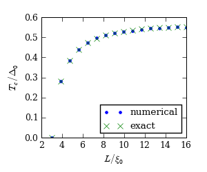

.. index:: critical temperature, superconducting wire

**********************************************************
Critical temperature in a NSN structure (MPI-parallelized)
**********************************************************

.. currentmodule:: usadel1

Consider a NSN structure:

    .. aafig::

       N KKKKKKKKKKKKK N

where the wire (of length :math:`L_s`) between the N-terminals is
superconducting.  Because of the normal terminals, the critical
temperature of the superconducting wire is less than the bulk
:math:`T_c`.  One can easily show that the critical temperature here
is given as a solution of

.. math::
   :label: tc-s

   \frac{1}{\lambda}
   = 
   \psi\left(\frac{3}{2}+\frac{\alpha}{4\pi T_c} + \frac{\omega_D}{2\pi T_c}\right)
   -
   \psi\left(\frac{1}{2} + \frac{\alpha}{4\pi T_c}\right)

where :math:`\alpha=\pi^2/L_s^2` is the smallest eigenvalue of
:math:`-\nabla^2`, :math:`\psi` is the digamma function,
:math:`\lambda` the superconducting coupling constant, and
:math:`\omega_D` the cutoff frequency. Keeping :math:`\Delta(T=0)=\Delta_0`
constant, :eq:`tc-s` approaches

.. math::
   :label: tc-s-inf

   \ln\frac{\Delta_0}{4\pi T_c} = \psi(\frac{1}{2} + \frac{\alpha}{4\pi T_c})

when :math:`\omega_D\rightarrow\infty`. For :math:`\alpha=0`, the usual
BCS result :math:`T_c=\Delta_0 e^\gamma/\pi` is retrieved.

.. index:: parallelization, MPI

We can also compute this temperature numerically, by making use of the
self-consistent iteration implemented in functions
:func:`self_consistent_matsubara_iteration` or
:func:`self_consistent_realtime_iteration`.  The code for this
computation is given in `example-nsn-tc.py
<_static/scripts/example-nsn-tc.py>`__

A multicore version (without MPI) of the same script is in 
`example-nsn-tc-multiprocessing.py <_static/scripts/example-nsn-tc-multiprocessing.py>`__

.. index:: mpi4py

This code also serves as an example on how to write MPI-parallelized
code with the mpi4py_ Python module.  :mod:`usadel1` does not itself
support parallel computation, but sweeps over parameter ranges can be
distributed to multiple processors.  To run this on 8 processors in
parallel, you can do::

    mpirun -np 8 python example-nsn-tc.py

The mpi4py_ module exposes a standard MPI interface --- if you are
familiar with how MPI parallel codes work in general, you should have
no problems understanding what is going on. If you want to learn more
about MPI, many guides exist --- for example
"`Rinnakkaisohjelmointi MPI:llä
<http://www.csc.fi/csc/julkaisut/oppaat/index_html>`__" by CSC Finland
(in Finnish), or the book "Parallel Programming with MPI" by
P.S. Pachero.

.. _mpi4py: http://mpi4py.scipy.org/

The result is shown in the figure below:

The wire is superconducting only for :math:`L_s > \pi \xi_0`.

.. seealso::

   `example-nsn-tc.py <_static/scripts/example-sns-tc.py>`__
   `example-nsn-tc-multiprocessing.py <_static/scripts/example-sns-tc-multiprocessing.py>`__

